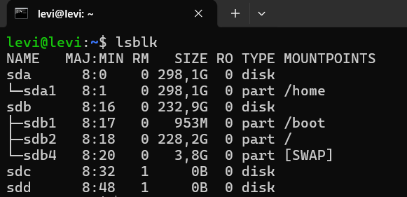
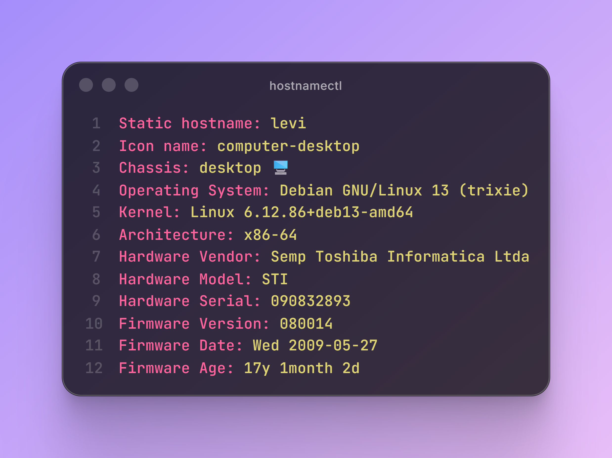
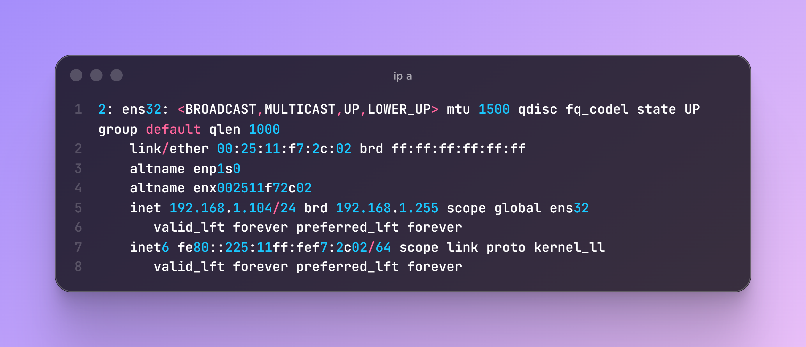

# 🐧 Instalação e Configuração do Debian Server

Este módulo aborda o processo de provisionamento, verificação de recursos de hardware e liberação de acesso remoto via SSH em um servidor Linux Debian.

---

## 1. Verificação de Recursos do Sistema
Após concluir a instalação básica, o primeiro passo é validar se os recursos de hardware (armazenamento e memória) foram alocados corretamente no sistema.

### 💾 Alocação de Armazenamento (`df -h`)
Exibe o espaço livre e utilizado nas partições montadas no disco rígido.

  

### 🧠 Uso de Memória RAM (`free -h`)
Verifica a quantidade de memória RAM física e partições Swap disponíveis e em uso.

  

### 📊 Estrutura de Blocos (`lsblk`)
Lista os detalhes sobre todos os dispositivos de bloco (discos e partições) conectados à máquina.

  

---

## 2. Configurações de Rede e Hostname

### 🪪 Identificação do Servidor (`hostnamectl`)
Mostra informações detalhadas sobre o nome da máquina, arquitetura e a versão do Kernel instalada.

  

### 🌐 Endereçamento de Rede (`ip a`)
Identifica as interfaces de rede ativas e o endereço IP privado atribuído ao servidor para conexões locais.

  

---

## 3. Acesso Remoto Segurado (SSH)

### ⚙️ Status do Serviço (`systemctl status ssh`)
Valida se o servidor OpenSSH está ativo, em execução e escutando na porta correta (padrão 22).

  

### 📺 Demonstração Prática de Acesso
Assista ao vídeo abaixo para acompanhar o fluxo completo de conexão remota ao terminal do Debian:

  <video src="https://github.com" width="80%" controls></video>

