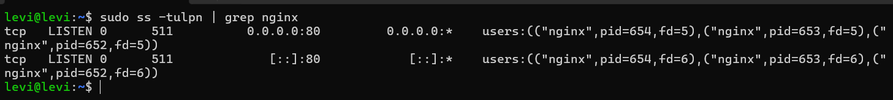

## 🌐 Nginx Web Server (Debian)

Instalação e configuração inicial do servidor Web Nginx em um nó Debian para hospedagem de páginas internas.

### 📥 1. Instalação e Verificação

O pacote foi instalado nativamente através do gerenciador de pacotes do Debian:

```bash
# Atualização dos repositórios e instalação do Nginx
sudo apt update && sudo apt install nginx -y
```

Após a instalação, foi validado que o serviço iniciou corretamente e foi verificado em qual porta ele estava escutando:

```bash
# Verificar portas em escuta para confirmar o Nginx
sudo ss -tulpn | grep LISTEN
```
* **Resultado:** O serviço subiu escutando na porta **:80**.
* **Acesso:** Validado com sucesso pelo navegador da máquina principal através do endereço `http://192.168.1.104:80`.

---

### 📝 2. Customização da Página Padrão

A página padrão do Nginx no Debian fica localizada no diretório `/var/www/html/`. Para testar o servidor, o arquivo foi editado:

```bash
# Localização do arquivo padrão
ls /var/www/html/index.nginx-debian.html
```

1. Foi adicionada uma tag personalizada `<h1>` dentro do arquivo HTML para identificar o Homelab.
2. Para aplicar a alteração sem derrubar o servidor, o comando de reload foi executado (atenção ao uso de letras minúsculas):
   ```bash
   sudo nginx -s reload
   ```

---

### 🛠️ 3. Solução de Problemas (Troubleshooting)

Durante os testes de configuração e leitura do arquivo principal (`cat /etc/nginx/nginx.conf`), o servidor parou de responder:

* **Problema:** Erro "Não é possível acessar esse site" após rodar o comando de encerramento:
  ```bash
  sudo nginx -s quit
  ```
* **Solução:** O comando `quit` encerra o processo do Nginx por completo. Para restabelecer o serviço e colocar o servidor online novamente, o binário foi chamado diretamente:
  ```bash
  sudo nginx OU sudo systemctl start nginx
  ```

  
