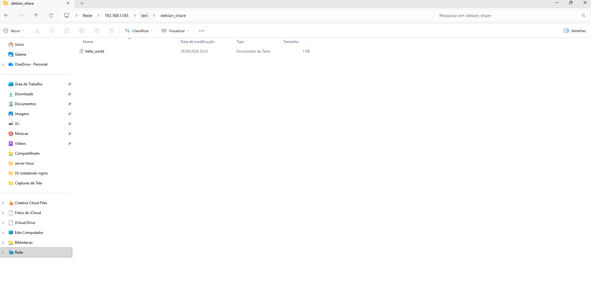

# Projeto 04 - Servidor de Arquivos com Samba

## Objetivo

Compartilhar arquivos entre um servidor Debian e um computador Windows utilizando o Samba.

## Tecnologias

- Samba
- Linux Permissions
- Windows File Sharing

## O que foi feito

- Instalação do Samba
- Criação de usuário Samba
- Criação do compartilhamento
- Configuração do smb.conf
- Testes de acesso pelo Windows

## Estrutura

Compartilhamento criado

```
/home/levi/debian_share
```



## Problema encontrado

Após autenticar no Windows, o acesso era negado.

## Investigação

Foi utilizado:

```bash
namei -l /home/levi/debian_share
```
```bash
f: /home/levi/debian_share
drwxr-xr-x root root             /
drwxr-xr-x root root             home
drwx--x--x levi levi             levi
drwxrwx--- levi compartilhamento debian_share
```

Foi identificado que o diretório `/home/levi` possuía permissão `700`, impedindo que outros usuários atravessassem o caminho até a pasta compartilhada.

## Solução

```bash
chmod 711 /home/levi
```

Após essa alteração, o acesso ao compartilhamento passou a funcionar corretamente.

## Conceitos aprendidos

- chmod
- chown
- Grupos Linux
- Grupos Samba
- Permission Traversal
- Diferença entre autenticação e autorização