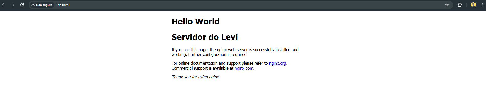

# Projeto 05 - Servidor DNS com dnsmasq

## Objetivo

Criar um servidor DNS interno para acessar serviços utilizando nomes ao invés de endereços IP.

Antes

```
http://192.168.1.145
```

Depois

```
http://lab.local
```

## Tecnologias

- dnsmasq
- DNS

## Configuração

Arquivo

```
/etc/dnsmasq.conf
```

Registro

```
interface=ens32,lo
address=/lab.local/192.168.1.145
```

## Testes

Servidor

```bash
host lab.local
```

```bash
lab.local has address 192.168.1.145
```

Windows

```cmd
nslookup lab.local
```

```
Servidor:  UnKnown
Address:  192.168.1.145

Nome:    lab.local
Address:  192.168.1.145
```

Navegador

```
http://lab.local
```



## Conceitos aprendidos

- Resolver
- Root DNS
- TLD
- Servidor Autoritativo
- Hostname
- Domínio
- FQDN